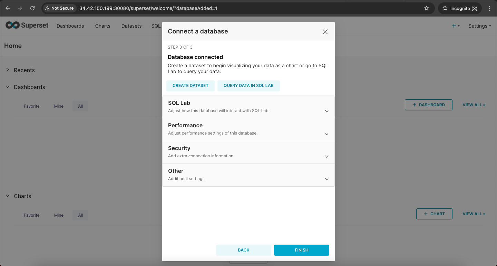

# Steps For Setting the SuperSet and Clichouse in Minikube

### Clickhouse Hot-Cold Configuration in Persistent Volume

### Clickhouse Hot-Cold Configuration in S3 (Cold-Hot-S3)[https://github.com/shashank3656/DataZip/tree/master/Clickhouse/cold-hot-s3/README.md]
    
# Perquisites


1) Any Cloud Account(Deploy the Minikube in the EC2 VMS)
2) Terraform
3) Helm
4) Superset
5) Clickhouse


# Install Kubernetes Using Script

### `Step1: On Master Node Only`

```sh
## Install Docker
sudo wget https://raw.githubusercontent.com/lerndevops/labs/master/scripts/installDocker.sh -P /tmp
sudo chmod 755 /tmp/installDocker.sh
sudo bash /tmp/installDocker.sh
sudo systemctl restart docker.service

## Install CRI-Docker
sudo wget https://raw.githubusercontent.com/lerndevops/labs/master/scripts/installCRIDockerd.sh -P /tmp
sudo chmod 755 /tmp/installCRIDockerd.sh
sudo bash /tmp/installCRIDockerd.sh
sudo systemctl restart cri-docker.service

## Install kubeadm,kubelet,kubectl
sudo wget https://raw.githubusercontent.com/lerndevops/labs/master/scripts/installK8S.sh -P /tmp
sudo chmod 755 /tmp/installK8S.sh
sudo bash /tmp/installK8S.sh

# Validate 

   docker -v
   cri-dockerd --version
   kubeadm version -o short
   kubelet --version
   kubectl version --client

## Initialize kubernetes Master Node
 
   sudo kubeadm init --cri-socket unix:///var/run/cri-dockerd.sock --ignore-preflight-errors=all

   sudo mkdir -p $HOME/.kube
   sudo cp -i /etc/kubernetes/admin.conf $HOME/.kube/config
   sudo chown $(id -u):$(id -g) $HOME/.kube/config

   ## install networking driver -- Weave/flannel/canal/calico etc... 

   ## below installs calico networking driver 
    
   kubectl apply -f https://raw.githubusercontent.com/projectcalico/calico/v3.24.1/manifests/calico.yaml

   # Validate:  kubectl get nodes
```

### `Step2: On All Worker Nodes`

```sh
## Install Docker
sudo wget https://raw.githubusercontent.com/lerndevops/labs/master/scripts/installDocker.sh -P /tmp
sudo chmod 755 /tmp/installDocker.sh
sudo bash /tmp/installDocker.sh
sudo systemctl restart docker.service

## Install CRI-Docker
sudo wget https://raw.githubusercontent.com/lerndevops/labs/master/scripts/installCRIDockerd.sh -P /tmp
sudo chmod 755 /tmp/installCRIDockerd.sh
sudo bash /tmp/installCRIDockerd.sh
sudo systemctl restart cri-docker.service

## Install kubeadm,kubelet,kubectl
sudo wget https://raw.githubusercontent.com/lerndevops/labs/master/scripts/installK8S.sh -P /tmp
sudo chmod 755 /tmp/installK8S.sh
sudo bash /tmp/installK8S.sh


# Validate 

   docker -v
   cri-dockerd --version
   kubeadm version -o short
   kubelet --version
   kubectl version --client

# Enable and configure bridge networking and iptables filtering for Docker or other containerization tools. 

sudo modprobe bridge
cat /proc/sys/net/bridge/bridge-nf-call-iptables
sudo modprobe br_netfilter
cat /proc/sys/net/bridge/bridge-nf-call-iptables
sudo sysctl -w net.bridge.bridge-nf-call-iptables=1
echo "net.bridge.bridge-nf-call-iptables=1" | sudo tee -a /etc/sysctl.conf
sudo sysctl -p
   
## Run Below on Master Node to get join token 

kubeadm token create --print-join-command 

    copy the kubeadm join token from master &
           ensure to add --cri-socket unix:///var/run/cri-dockerd.sock as below &
           ensure to add sudo 
           then run on worker nodes

    Ex: sudo kubeadm join 10.128.15.231:6443  --token mks3y2.v03tyyru0gy12mbt \
           --discovery-token-ca-cert-hash sha256:3de23d42c7002be0893339fbe558ee75e14399e11f22e3f0b34351077b7c4b56 --cri-socket unix:///var/run/cri-dockerd.sock
```

# By default core DNS will be 2 replicas

```sh
kubectl get pods -n kube-system

kubectl edit deploy coredns -n kube-system

By changing the replicas the coredns pods to your current nodes

example 
 replicas: 2 to 
 replicas: 3

```

# Install Terraform

### `For Linux (Ubuntu/Debian-based distributions):`
```sh
sudo apt update
sudo apt install -y gnupg software-properties-common
wget -qO- https://apt.releases.hashicorp.com/gpg | sudo gpg --dearmor -o /usr/share/keyrings/hashicorp-archive-keyring.gpg
sudo apt-add-repository "deb [signed-by=/usr/share/keyrings/hashicorp-archive-keyring.gpg] https://apt.releases.hashicorp.com $(lsb_release -cs) main"
sudo apt update
sudo apt install terraform
terraform --version
```

# Install helm

### `For Linux (Ubuntu/Debian-based distributions):`

```sh
curl https://baltocdn.com/helm/signing.asc | sudo apt-key add -
sudo apt-get install apt-transport-https --yes
echo "deb https://baltocdn.com/helm/stable/debian/ all main" | sudo tee /etc/apt/sources.list.d/helm-stable-debian.list
sudo apt-get update
sudo apt-get install helm
```

# Deploy Superset & ClickHouse

### `1.Clone the Github Repo`

```sh
git clone https://github.com/shashank3656/DataZip.git
unzip Datazip  # For installing Unzip sudo apt install unzip
cd Datazip/Terraform
```

### `2. Geneate the Password for ClickHouse using Double hax(Note: If u r using SHA1)`

```sh
PASSWORD=$(base64 < /dev/urandom | head -c8); echo "$PASSWORD"; echo -n "$PASSWORD" | sha1sum | tr -d '-' | xxd -r -p | sha1sum | tr -d '-'
```

```txt
replace the Output in the configmap.yaml in the below file <password_double_sha1_hex>Replace</password_double_sha1_hex>

users.xml: |
    <?xml version="1.0"?>
    <clickhouse>
        <profiles>
            <!-- Default profile with memory and load balancing configurations -->
            <default>
                <max_memory_usage>10000000</max_memory_usage>  <!-- Set max memory usage to 10 GB -->
                <load_balancing>random</load_balancing>
            </default>
            <!-- Readonly profile with readonly flag set -->
            <readonly>
                <readonly>1</readonly>
            </readonly>
        </profiles>

        <users> 
          <!-- Default user configuration -->
          <default>
            <password_double_sha1_hex>7dc366355ed7a983876a29d69a9586d5c2bd98b4</password_double_sha1_hex>
            <networks>
              <ip>::/0</ip>  <!-- Allow connections from any IP address -->
            </networks>
            <profile>default</profile>
            <quota>default</quota>
          </default>
        </users>

        <quotas>
            <default>
                <interval>
                    <duration>3600</duration>  <!-- 1 hour interval -->
                    <queries>1000</queries>  <!-- Allow 1000 queries per interval -->
                    <errors>20</errors>  <!-- Allow 10 errors per interval -->
                    <result_rows>10000000</result_rows>  <!-- Limit to 10 million result rows -->
                    <read_rows>100000000</read_rows>  <!-- Limit to 100 million read rows -->
                    <execution_time>3600</execution_time>  <!-- Max execution time of 3600 seconds (1 hour) -->
                </interval>
            </default>
        </quotas>
    </clickhouse>
```


### `3.Deploy the SuperSet & ClickHouse using Terraform Script`

### `main.tf`
```tf
# Provider Name Kubernetes
provider "kubernetes" {
    config_path = var.kubeconfig_path
}

# Provider Name Helm
provider "helm" {
  kubernetes {
    config_path = var.kubeconfig_path
  }
}

# Namespace for ClickHouse
resource "kubernetes_namespace" "clickhouse" {
    metadata {
        name = var.namespace_clickhouse
    }
}

# Namespace for Superset
resource "kubernetes_namespace" "superset" {
    metadata {
        name = var.namespace_superset
    }
}

# ClickHouse Cold PV File 
resource "kubernetes_manifest" "clickhouse-pv-cold" {
    depends_on = [ kubernetes_namespace.clickhouse ]
    manifest = yamldecode(file(var.pv_cold_file_path))
}

# ClickHouse Hot PV File 
resource "kubernetes_manifest" "clickhouse-pv-hot" {
    depends_on = [ kubernetes_manifest.clickhouse-pv-cold ]
    manifest = yamldecode(file(var.pv_hot_file_path))
}

# ClickHouse Cold PVC File 
resource "kubernetes_manifest" "clickhouse-pvc-cold" {
    depends_on = [ kubernetes_manifest.clickhouse-pv-hot ]
    manifest = yamldecode(file(var.pvc_cold_file_path))
}

# ClickHouse Hot PVC File 
resource "kubernetes_manifest" "clickhouse-pvc-hot" {
    depends_on = [ kubernetes_manifest.clickhouse-pvc-cold ]
    manifest = yamldecode(file(var.pvc_hot_file_path))
}

# ClickHouse ConfigMAP File 
resource "kubernetes_manifest" "clickhouse-configmap" {
    depends_on = [ kubernetes_manifest.clickhouse-pvc-hot ]
    manifest = yamldecode(file(var.config_file_path))
}

# ClickHouse Deployment File 
resource "kubernetes_manifest" "clickhouse-deployment" {
    depends_on = [ kubernetes_manifest.clickhouse-configmap ]
    manifest = yamldecode(file(var.deploy_file_path))
}

# ClickHouse Service File 
resource "kubernetes_manifest" "clickhouse-service" {
    depends_on = [ kubernetes_manifest.clickhouse-deployment ]
    manifest = yamldecode(file(var.service_file_path))
}

# SuperSet PV File 
resource "kubernetes_manifest" "superset-pv" {
    depends_on = [ kubernetes_namespace.superset ]
    manifest = yamldecode(file(var.superset_pv_file_path))
}

# SuperSet PVC File 
resource "kubernetes_manifest" "superset-pvc" {
    depends_on = [ kubernetes_manifest.superset-pv ]
    manifest = yamldecode(file(var.superset_pvc_file_path))
}


# SuperSet Using Helm
# Helm release for Superset with custom values.yaml
resource "helm_release" "superset" {
    depends_on = [ kubernetes_manifest.superset-pvc ]
    name       = var.superset_name
    namespace  = var.namespace_superset
    chart      = var.chart_path  # Path to local Helm chart
    
    values = [file(var.values_file)]  # Use your custom values.yaml file
    # Optional: Wait for the release to be fully deployed before finishing
    wait = true
    
    # Optional: Timeout for Helm install
    timeout = 600  # in seconds
}


# External data source to retrieve service details
data "external" "clickhouse_service_details" {
  program = ["bash", "-c", <<EOT
SERVICE_NAME=$(kubectl get svc -n clickhouse -o json | jq -r '.items[] | select(.metadata.name=="clickhouse-service")')
NODE_PORT=$(echo "$SERVICE_NAME" | jq -r '.spec.ports[0].nodePort')
NODE_IP=$(kubectl get nodes -o json | jq -r '.items[0].status.addresses[] | select(.type=="ExternalIP").address')
echo "{\"node_port\": \"$NODE_PORT\", \"node_ip\": \"$NODE_IP\"}"
EOT
  ]
}

# External data source to fetch IP and port details
data "external" "superset_service_details" {
  depends_on = [helm_release.superset] # Ensure Helm release is installed first
  program = ["bash", "-c", <<EOT
SERVICE_NAME=$(kubectl get svc -n ${var.namespace_superset} -o json | jq -r '.items[] | select(.metadata.name=="${helm_release.superset.name}")')
NODE_PORT=$(echo "$SERVICE_NAME" | jq -r '.spec.ports[0].nodePort')
NODE_IP=$(kubectl get nodes -o json | jq -r '.items[0].status.addresses[] | select(.type=="ExternalIP").address')
echo "{\"node_port\": \"$NODE_PORT\", \"node_ip\": \"$NODE_IP\"}"
EOT
  ]
}
```

### `Variables.tf`
```tf
variable "kubeconfig_path" {
  description = "Path to the kubeconfig file"
  type        = string
}

variable "namespace_clickhouse" {

}

variable "namespace_superset" {

}

variable "deploy_file_path" {

}

variable "service_file_path" {
  
}

variable "pv_cold_file_path" {
  
}

variable "pv_hot_file_path" {
  
}

variable "pvc_cold_file_path" {
  
}

variable "pvc_hot_file_path" {
  
}

variable "config_file_path" {
  
}

variable "superset_name" {
  
}

variable "superset_pv_file_path" {
  
}

variable "superset_pvc_file_path" {
  
}

variable "chart_path" {
  
}

variable "values_file" {
  
}
```

### `terraform.tfvars`
```tf
kubeconfig_path = "~/.kube/config"

# clichouse
namespace_clickhouse = "clickhouse"
deploy_file_path = "~/DataZip/Clickhouse/cold-hot-local/deployment.yaml"
service_file_path = "~/DataZip/Clickhouse/cold-hot-local/service.yaml"
pv_cold_file_path = "~/DataZip/Clickhouse/cold-hot-local/pv-cold.yaml"
pv_hot_file_path = "~/DataZip/Clickhouse/cold-hot-local/pv-hot.yaml"
pvc_cold_file_path = "~/DataZip/Clickhouse/cold-hot-local/pvc-cold.yaml"
pvc_hot_file_path = "~/DataZip/Clickhouse/cold-hot-local/pvc-hot.yaml"
config_file_path = "~/DataZip/Clickhouse/cold-hot-local/configmap.yaml"

# superset
namespace_superset = "superset"
superset_name = "superset"
superset_pv_file_path = "~/DataZip/superset/pv.yaml"
superset_pvc_file_path = "~/DataZip/superset/pvc.yaml"
chart_path = "~/DataZip/superset/." 
values_file = "~/DataZip/superset/values.yaml"
```

### `Outputs.tf`

```tf
#  Output the Clickhouse Ip and Port
output "clickhouse_node_port" {
  value = data.external.clickhouse_service_details.result.node_port
}

output "clickhouse_node_ip" {
  value = data.external.clickhouse_service_details.result.node_ip
}


#  Output the SuperSet service details
output "superset_node_ip" {
  value = data.external.superset_service_details.result.node_ip
}

output "superset_node_port" {
  value = data.external.superset_service_details.result.node_port
}
```

# Deploy Terraform Script using below CMD
```sh
cd DataZip/Terraform
terraform init
terraform validate
terraform plan
terraform apply
```


# SetUp Clickhouse
Use End URl of the ClickHouse 
http://<IP>:<Port>/play
```sql

-- Show Databases
SHOW databases;

-- Create Database
Create Database dz_test;

-- Use the Database
USE dz_test;

-- Create a table with Storage Policy
CREATE TABLE dz_test
(
    number UInt32,
    number2 UInt32,
    date Date
)
ENGINE = MergeTree()
PARTITION BY toYYYYMM(date)
ORDER BY (date, number)
SETTINGS storage_policy = 'hot_cold';

-- Insert data using normal
insert into dz_test select number, number, '2023-01-01' from numbers(1e4);

-- Insert data using hot and cold
insert into dz_test select number, number, '2023-01-01' from numbers(1e9);

-- See the data
select * from dz_test LIMIT=1000;
```

# Insert the Normal Data in the Normal PVC


# Query the Normal Data


# Insert the One billion Data in the Cold Hot PVC


# SetUp Superset

1) Use the Login Details Below for Superset
   ```txt
   username: admin
   password: admin
   ```

2) Click Connect Database

3) Select ClickConnect Database
   ```txt
   ClickHouse Host:
   ClickHouse Port:
   ClickHouse Database:
   Clickhouse Password:
   ``` 
   

   

4) Query the ClickHouse data using SQLABS
   


# To Destroy the ClickHouse and Superset
```sh
terraform destroy
```


# Reference

- [Superset Helm Chart](https://github.com/apache/superset/releases/tag/superset-helm-chart-0.13.4)
- [Click House Installation](https://clickhouse.com/docs/en/install)
- [AWS S3 Driver Helm Chart](https://github.com/awslabs/mountpoint-s3-csi-driver/releases/download/helm-chart-aws-mountpoint-s3-csi-driver-1.11.0/aws-mountpoint-s3-csi-driver-1.11.0.tgz)
- [AWS Intergating with Clickhouse](https://clickhouse.com/docs/en/integrations/s3)
